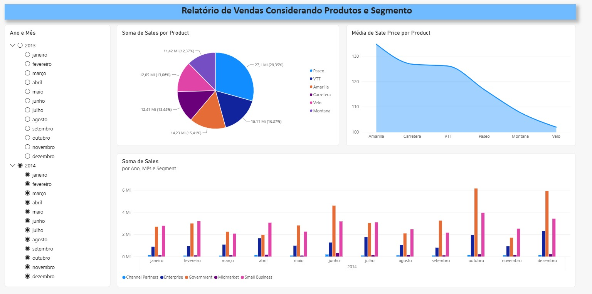
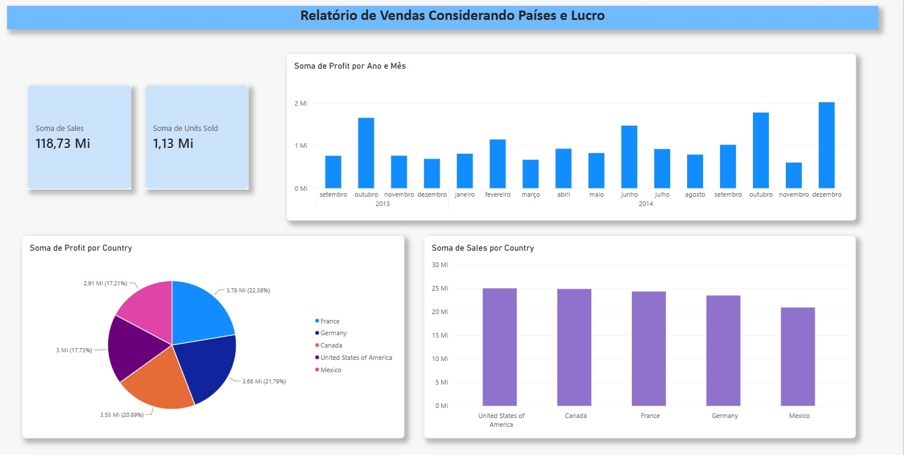
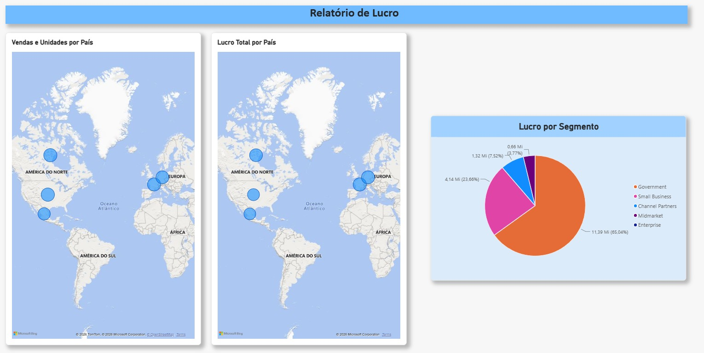

# 📊 Desafio de Projeto: Dashboard de Vendas com Power BI

Projeto prático desenvolvido como parte do bootcamp de análise de dados na plataforma [Digital Innovation One (DIO)](https://www.dio.me/).

---

## 🎯 Objetivo do Desafio
O propósito deste projeto foi replicar e expandir um relatório analítico utilizando o *Microsoft Power BI Desktop*, a partir da base de dados disponibilizada (Financial Sample.xlsx).

O projeto contempla:
1. Replicação das duas páginas instruídas durante o curso.
2. Criação autônoma de uma terceira página focada em análise geográfica e segmentação de lucros.
3. Organização de layout, clareza nos títulos dos visuais e parametrização de dicas de ferramentas (tooltips).

---

## 📑 Estrutura do Relatório

### 🔹 Página 1: Visão Geral de Vendas
Focada em apresentar os principais indicadores e métricas financeiras da operação:
* *Cartões de KPI:* Totais gerais de Vendas (Sales) e Lucro (Profit).
* *Gráfico de Vendas por Período:* Acompanhamento temporal da evolução do faturamento.
* *Gráfico de Vendas por Produto:* Comparativo do desempenho de faturamento por linha de produto.
* *Segmentação de Dados:* Filtro interativo por segmento de mercado.

---

### 🔹 Página 2: Detalhamento Financeiro e Lucratividade
Destinada a aprofundar a relação entre volume faturado, descontos e margem líquida:
* *Gráfico de Lucro por Produto e Segmento:* Visão detalhada da contribuição de margem de cada produto.
* *Gráfico de Vendas vs. Descontos:* Comparativo de sazonalidade e impacto da concessão de descontos nas vendas totais.
* *Tabela Sintética:* Tabela com resumo cruzado de países, produtos, quantidades e métricas de receita/lucro.

---

### 🔹 Página 3: Análise Geográfica e Segmentos (Desafio Prático)
Página criada com os visuais solicitados no desafio:
* *Mapa 1 (Volume de Vendas e Unidades por País):*
  * Localização: Country
  * Tamanho da Bolha: Sales
  * Dicas de Ferramenta (Tooltips): Units Sold
* *Mapa 2 (Distribuição de Lucro por País):*
  * Localização: Country
  * Tamanho da Bolha / Preenchimento: Profit
* *Gráfico de Pizza (Participação do Lucro por Segmento):*
  * Legenda: Segment
  * Valores: Profit

---

## 🛠️ Tecnologias e Ferramentas
* *Microsoft Power BI Desktop* (Importação, modelagem e visualização de dados)
* *Dataset:* Financial Sample.xlsx
* *Git & GitHub* (Versionamento e documentação do projeto)

---

## 🚀 Como Visualizar o Projeto
1. Clone ou faça o download deste repositório.
2. Certifique-se de ter o [Power BI Desktop](https://powerbi.microsoft.com/desktop/) instalado no seu computador.
3. Abra o arquivo com a extensão .pbix localizado na pasta raiz do repositório.
